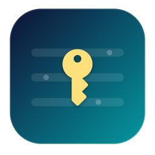

<p align="center">
  
</p>

# Env Pilot

> Environment Variables deserve an IDE.

Env Pilot은 개인 개발자가 여러 프로젝트와 Environment의 `.env` 변수를 한곳에서 관리하는 macOS 앱입니다. Git 저장소와 Monorepo 구조를 이해하고, `.env.example` 변경을 추적하며, 필요한 `.env` 파일을 안전하게 생성합니다.

## 주요 기능

- Repository와 Monorepo Target 관리
- Local / Development / Staging / Production 등 Environment별 변수 편집
- Secret의 iCloud Keychain 저장 및 마스킹
- `.env.example` 변경 감지와 누락 키 처리
- Environment 간 값 비교, Health 상태, 변경 이력
- `.env` 생성과 외부 수정(Drift) 감지
- `.gitignore`, Git tracked 상태, 파일 권한 검사
- `.env` 커밋을 차단하는 pre-commit hook
- 암호화된 `.envide` 번들 가져오기/내보내기
- iCloud 기반 Mac 간 동기화와 메뉴바 빠른 실행
- GitHub Releases를 통한 자동 업데이트

## 설치

1. [최신 GitHub Release](https://github.com/Bongseop-Kim/env-pilot/releases/latest)에서 `Env-Pilot-<version>.dmg`를 받습니다.
2. DMG를 열고 `env-pilot`을 `Applications` 폴더로 드래그합니다.

배포본은 Apple Developer ID로 서명·공증되어 있어 별도 확인 절차 없이 바로 실행됩니다.

요구 환경은 macOS 26.5 이상이며 Apple Silicon과 Intel Mac을 모두 지원합니다.

## 시작하기

1. 좌측 상단 `+` 버튼으로 프로젝트 폴더를 등록합니다.
2. 상단 Environment 메뉴에서 작업 환경을 선택합니다.
3. 기존 `.env`를 Import하거나 변수를 직접 추가합니다.
4. `Generate`로 Target별 출력 파일을 생성합니다.
5. `Health`와 `Git Changes`에서 누락 키, Git 안전성, 외부 변경을 확인합니다.

Secret 값은 SwiftData나 CloudKit에 평문으로 저장하지 않고 Keychain에 보관합니다. 생성된 `.env` 파일은 선택한 로컬 Repository에만 기록됩니다.

## 자동 업데이트

[Sparkle 2](https://sparkle-project.org/)가 GitHub Release의 `appcast.xml`을 주기적으로 확인하고 새 버전을 내려받아 설치합니다. 수동 확인은 앱 메뉴의 **업데이트 확인…**에서 할 수 있습니다.

각 Release에는 다음 파일이 함께 올라가야 합니다.

- `Env-Pilot-<version>.dmg`: 첫 설치용 디스크 이미지 (드래그앤드랍 설치)
- `Env-Pilot-<version>.zip`: Sparkle 자동 업데이트용 앱 번들
- `appcast.xml`: 버전, 다운로드 URL, EdDSA 서명이 포함된 업데이트 피드

## 개발

필요 환경:

- macOS 26.5+
- Xcode 26.5+

```bash
git clone https://github.com/Bongseop-Kim/env-pilot.git
cd env-pilot
open env-pilot.xcodeproj
```

Sparkle `2.9.2`는 Swift Package Manager로 자동 설치됩니다. 명령줄 빌드는 다음과 같습니다.

```bash
xcodebuild \
  -project env-pilot.xcodeproj \
  -scheme env-pilot \
  -configuration Debug \
  -derivedDataPath /tmp/env-pilot-build \
  CODE_SIGNING_ALLOWED=NO \
  build
```

상세 제품 요구사항과 설계 결정은 [PRD.md](PRD.md)를 참고하세요.

## 릴리스

1. Xcode 프로젝트의 `MARKETING_VERSION`과 `CURRENT_PROJECT_VERSION`을 증가시킵니다.
2. [RELEASE_NOTES.md](RELEASE_NOTES.md)를 갱신합니다.
3. 변경사항을 커밋하고 `v<MARKETING_VERSION>` 태그를 원격에 푸시합니다.
4. `gh auth login`이 완료된 환경에서 아래 명령을 실행합니다.

```bash
./scripts/release.sh --publish
```

스크립트는 유니버설 Release 빌드, Developer ID 서명·공증, zip 생성, EdDSA 서명 appcast 생성, 설치용 DMG 생성(서명·공증 포함), GitHub Release 업로드를 순서대로 수행합니다. DMG 생성에는 `create-dmg`가 필요합니다(`brew install create-dmg`). Sparkle 개인키는 macOS Keychain의 `com.bongsub.env-pilot` 계정에 보관되며 Repository에는 저장되지 않습니다.
